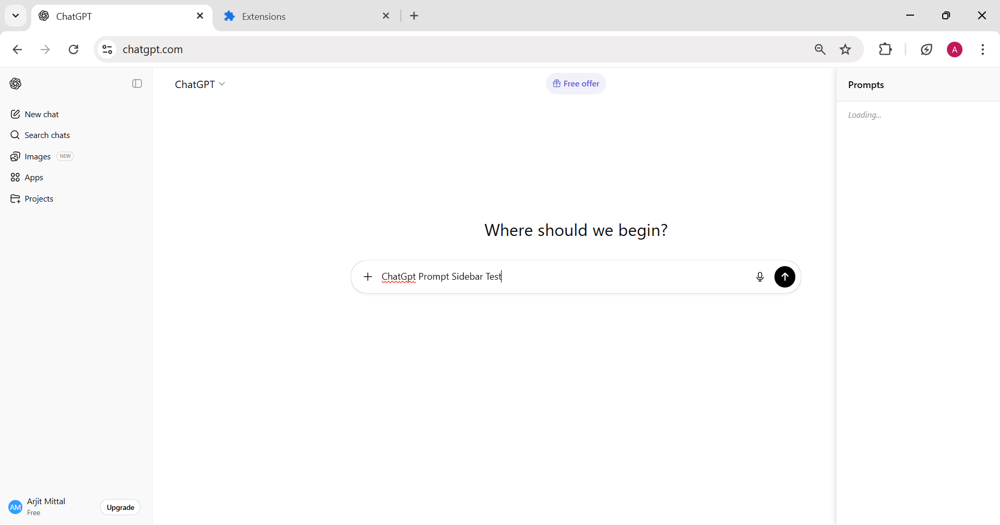
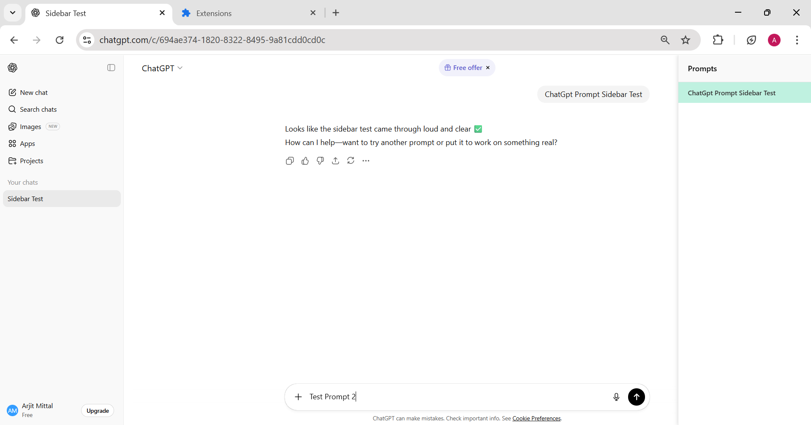
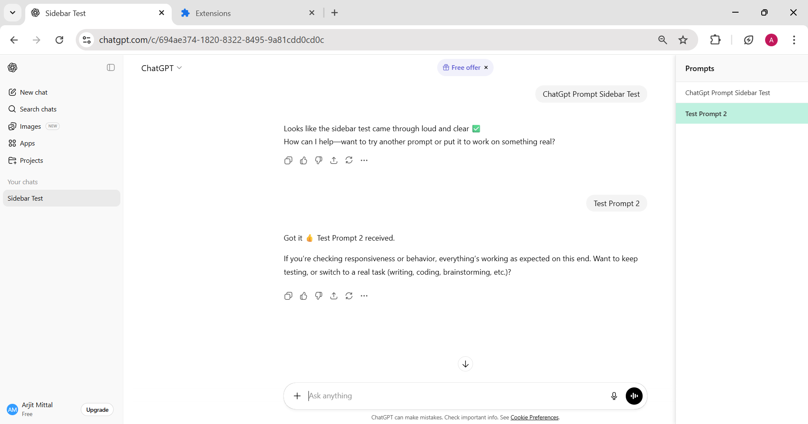
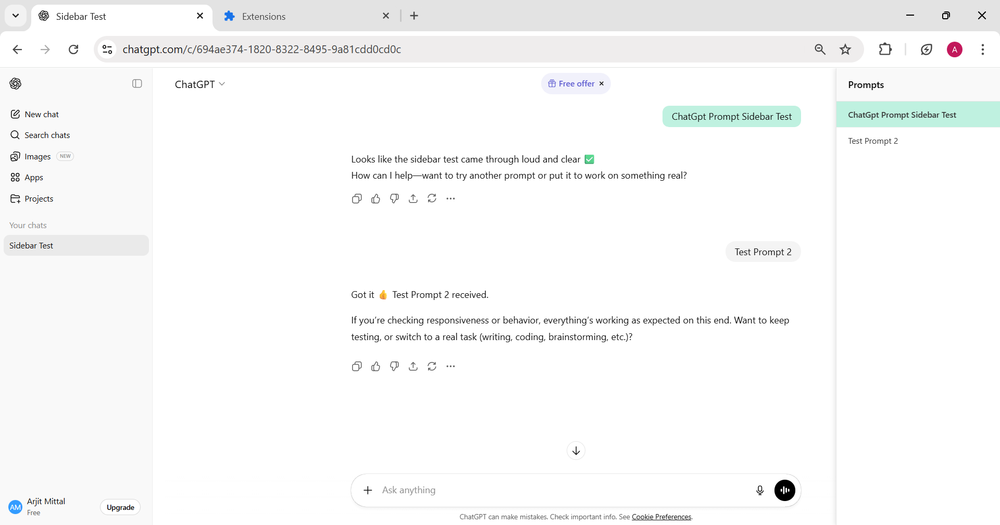
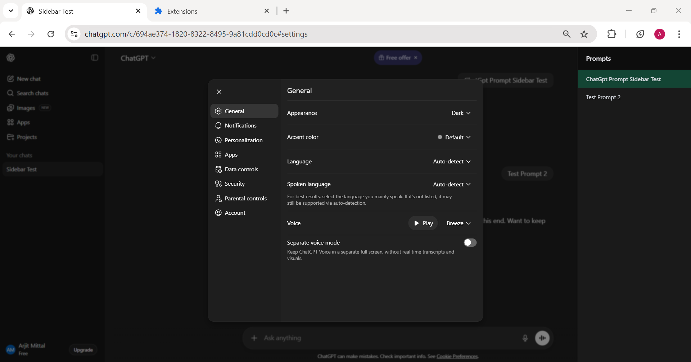
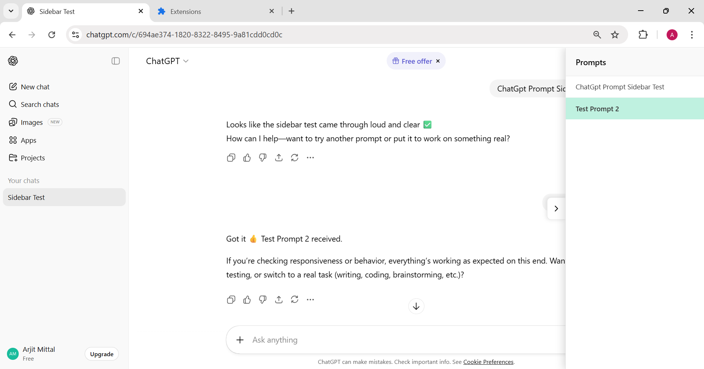
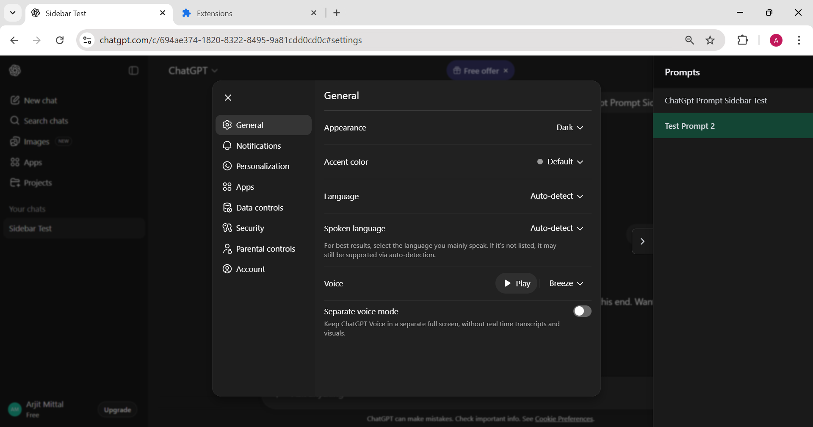

# ChatGPT Prompt Navigator

A lightweight browser extension that adds a **prompt history sidebar** to ChatGPT, allowing you to quickly view and jump between all your prompts in a conversation — no more endless scrolling.

## Features

- 📜 **Prompt History Sidebar** – Lists all user prompts from the current conversation.
- 📱 **Responsive Design**: Works seamlessly across all screen sizes
- 🧱 **Smart Layout**:
  - 🖥️ Desktop (≥1280px): Sidebar always visible, chat content adjusted
  - 💻 Tablet/Small Desktop (<1280px): Collapsible overlay sidebar with toggle button
  - 📲 Mobile: Optimized overlay that auto-closes after selecting a prompt
- ⚡ **Quick Navigation** – Click any prompt to instantly jump to it in the chat.
- 🎯 **Active Highlight** – Highlights the prompt currently in view.
- 🌓 **Dark Mode Support**: Automatically adapts to system dark mode
- ✨ **Visual Feedback**: Selected prompts get a temporary highlight animation
- 💡 **Lightweight** – Minimal CSS and JavaScript, loads quickly without slowing down ChatGPT.
- 🌐 **Browser Support** - Chrome & Edge (latest stable versions)

## 🎥 Prototype – ChatGPT Prompt Navigator - Video

[](https://www.youtube.com/watch?v=r5517KmE-nE)

## Prompts Sidebar

**No Prompt History**


**Single prompt**


**Multiple Prompts**


**Prompts navigation**


**Dark Mode - as per ChatGpt theme**


**Toggle Sidebar - to collapse**


**Toggle Dark Mode**


## Installation (Developer Mode)

1. Clone or download this repository:
   ```bash
   git clone https://github.com/am791/chatgpt-prompt-navigator.git
   ```
2. Open your browser’s Extensions page:
   - **Chrome**: `chrome://extensions/`
   - **Edge**: `edge://extensions/`
3. Enable **Developer Mode** (toggle in top right).
4. Click **Load unpacked**
5. Select the folder containing this extension.
6. Navigate to ChatGPT and start chatting!

## How It Works

- The extension injects a sidebar into ChatGPT pages (`https://chatgpt.com/*`) using `content.js`.
- The script scans for all **user prompts** in the chat and lists them in the sidebar.
- Clicking a prompt smoothly scrolls the main chat to that message, with a temporary highlight for visibility.
- The sidebar updates dynamically as you send new prompts, and the active prompt updates while scrolling.

### Desktop Experience (Wide Screens)
- Sidebar is permanently visible on the right
- Chat content automatically adjusts to make room
- No toggle needed - always accessible

### Tablet/Mobile Experience (Narrow Screens)
- Sidebar collapsed to maximize chat space
- Toggle button appears on the right edge of the screen
- Click to open/close the sidebar
- Sidebar overlays the chat (doesn't push content)
- Auto-closes after selecting a prompt on mobile

## Responsive Breakpoints

- **1280px+**: Desktop mode (sidebar always visible)
- **768px - 1279px**: Tablet mode (collapsible overlay, auto close)
- **Below 768px**: Mobile mode (optimized sizing, auto-close)


## Files

- `manifest.json`: Extension configuration (metadata and permissions)
- `content.js`: Main logic for detecting prompts, rendering the sidebar, and handling navigation
- `sidebar.css`: Styles for the sidebar, supporting both light and dark modes
- `icon.png`: Extension icon (used in the browser toolbar and extensions list)

## Usage Tips

- Scroll through your chat to see the active prompt highlight update
- Click any prompt in the sidebar to jump to that point in the conversation
- On small screens, use the arrow button to toggle the sidebar
- The sidebar automatically adapts when you resize your browser window

## Browser Support

- Chrome/Edge (Manifest V3)
- Should work on any Chromium-based browser

## Future Enhancements

- Export prompt history
- Search/filter prompts
- Custom themes
- Keyboard shortcuts

## License

This project is licensed under the [MIT License](LICENSE).  
You are free to use, modify, and distribute this code with attribution.

---

💡 *Built thoughtfully to make navigating ChatGPT effortless.*
