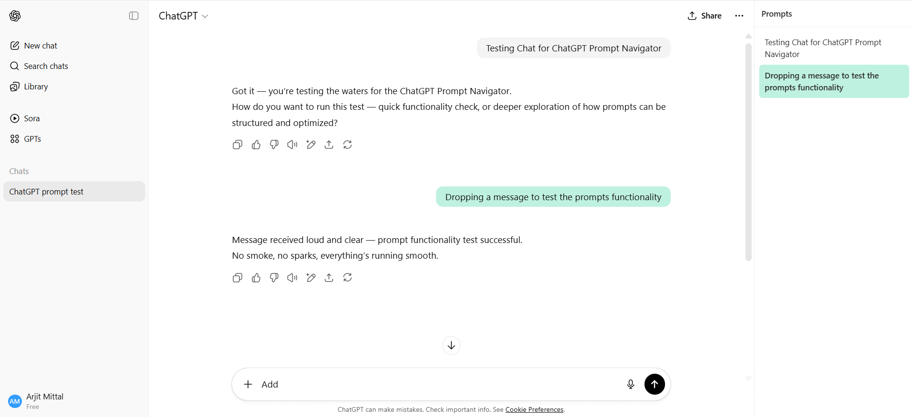
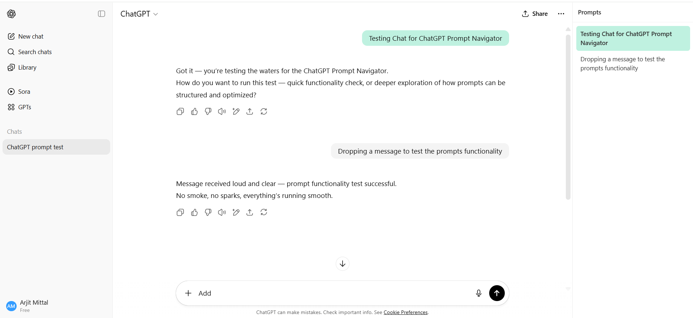

# ChatGPT Prompt Navigator

A lightweight browser extension that adds a **prompt history sidebar** to ChatGPT, allowing you to quickly view and jump between all your prompts in a conversation — no more endless scrolling.

## Features

- 📜 **Prompt History Sidebar** – Lists all user prompts from the current conversation.
- ⚡ **Quick Navigation** – Click any prompt to instantly jump to it in the chat.
- 🎯 **Active Highlight** – Highlights the prompt currently in view.
- 🌓 **Dark Mode Friendly** – Matches ChatGPT’s dark and light themes.
- 💡 **Lightweight** – Minimal CSS and JavaScript, loads quickly without slowing down ChatGPT.

## Prompts Sidebar

**Latest Prompt**


**Older Prompt**


## Installation (Developer Mode)

1. Clone or download this repository:
   ```bash
   git clone https://github.com/am791/chatgpt-prompt-navigator.git
   ```
2. Open your browser’s Extensions page:
   - **Chrome**: `chrome://extensions/`
   - **Edge**: `edge://extensions/`
3. Enable **Developer Mode** (top-right corner).
4. Click **Load unpacked** and select the folder containing this extension.

## How It Works

- The extension injects a sidebar into ChatGPT pages (`https://chatgpt.com/*`) using `content.js`.
- The script scans for all **user prompts** in the chat and lists them in the sidebar.
- Clicking a prompt smoothly scrolls the main chat to that message, with a temporary highlight for visibility.
- The sidebar updates dynamically as you send new prompts, and the active prompt updates while scrolling.

## Files

- **`manifest.json`** – Extension metadata and permissions
- **`icon.png`** – Extension icon (used in the browser toolbar and extensions list)
- **`sidebar.css`** – Styles for the sidebar, supporting both light and dark modes
- **`content.js`** – Main logic for detecting prompts, rendering the sidebar, and handling navigation

## License

This project is licensed under the [MIT License](LICENSE).  
You are free to use, modify, and distribute this code with attribution.

---

💡 *Built thoughtfully to make navigating ChatGPT effortless.*
